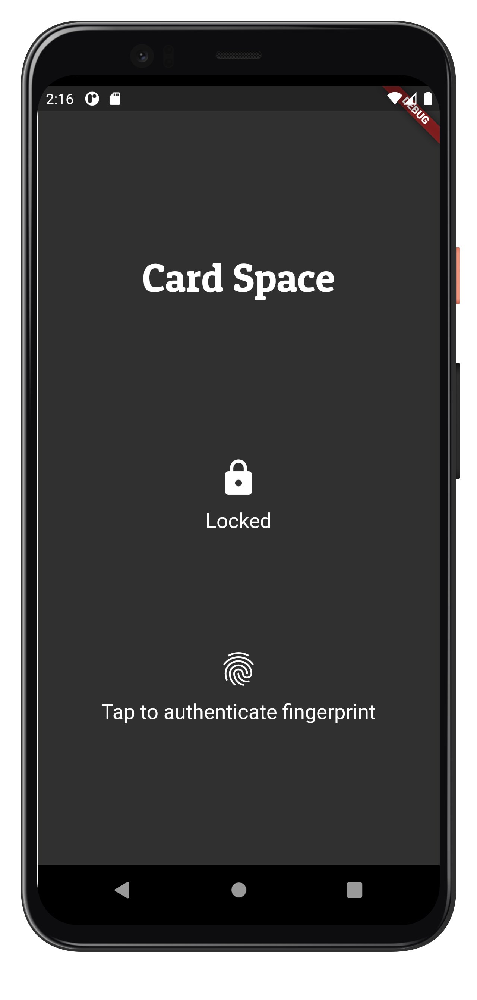
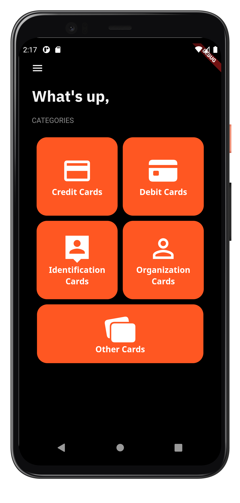
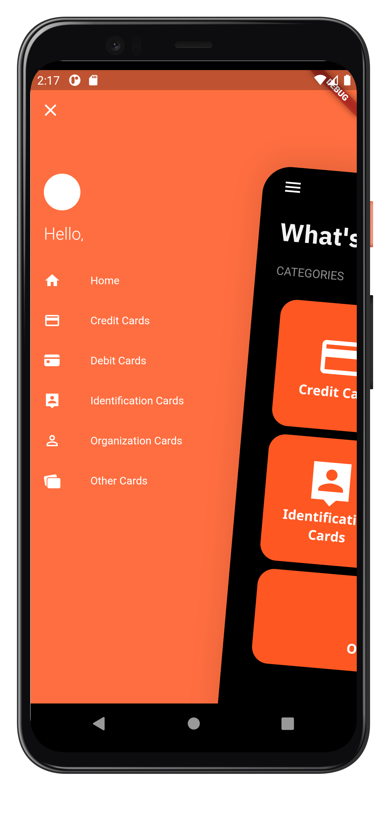
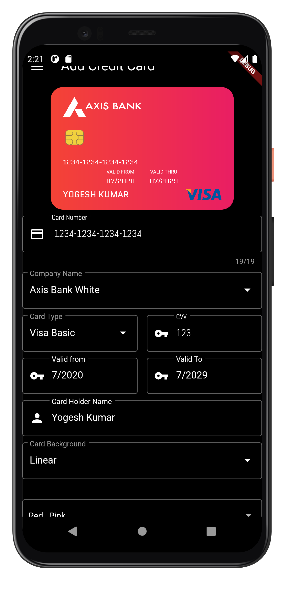
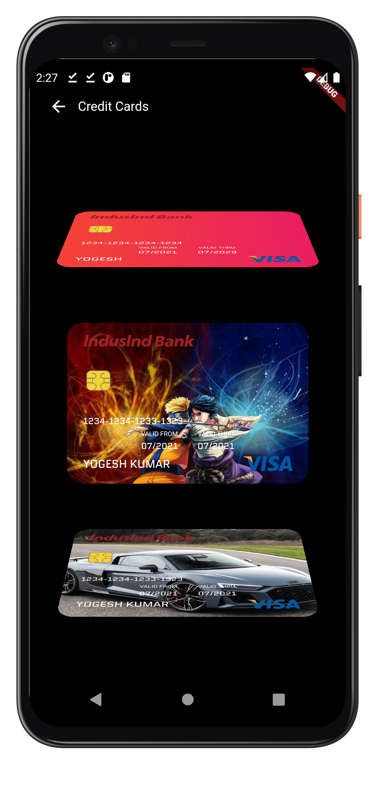

<p align="center"></p>
<h1 align="center">Cardspace</h1>
<p align="center"></p>

## Getting Started

A secured cross-platfom application that allows the user to save their cards like (Bank cards, Personal Identification Cards, etc) in a highly secured format. These card can be viewed by user anytime. The main problem it solves is that the user does not need to carry all the card while he can carry a single mobile phone with our installed.

Take control of your credit cards with this offline credit card manager (no need to create account or login online).It makes car management smart, simple and secure.
<br>

<!-- ### APK -->

<!-- [⬇️ Download apk here](https://github.com/Yogeshk4124/SyncPlayer/blob/main/APK/SyncPlayer.apk?raw=true) -->

## Some Features

- Secure.
- Works Offline.No privacy leaks.
- Modern design.
- Easy to use.
- Make your own custom cards.

### Show some :heart: and :star: the repo to support the project.

<!-- ## APK

### For Android

[⬇️ Download apk](https://github.com/Yogeshk4124/SyncPlayer/blob/main/APK/SyncPlayer.apk?raw=true) -->

## Screenshots

<hr>

### Mobile

    

## Pull Requests

I welcome and encourage all pull requests. Here are some basic rules to follow to ensure timely addition of your request:

1. Match coding style (braces, spacing, etc.) This is best achieved using `Reformat Code` feature of Android Studio `CMD`+`Option`+`L` on Mac and `CTRL` + `ALT` + `L` on Linux + Windows .
2. If its a feature, bug fix, or anything please only change code to what you specify.
3. Please keep PR titles easy to read and descriptive of changes, this will make them easier to merge :)
4. Pull requests _must_ be made against `develop` branch. Any other branch (unless specified by the maintainers) will get rejected.
5. Check for existing [issues](https://github.com/Yogeshk4124/Card-Space/issues) first, before filing an issue.
6. Make sure you follow the set standard as all other projects in this repo do
7. Have fun!<br>

## 👍 Contribution

1. Fork it
2. Create your feature branch (git checkout -b my-new-feature)
3. Commit your changes (git commit -m 'Add some feature')
4. Push to the branch (git push origin my-new-feature)
5. Create new Pull Request<br>

## Project setup

**Step 1:**

Download or clone this repo by using the link below:
```

https://github.com/Yogeshk4124/Card-Space.git

```

**Step 2:**

Go to project root and execute the following command in console to get the required dependencies:

```

flutter pub get

```

**Step 3:**

Run the project in Android Studion or whichever IDE you prefer or run the command:

```

flutter run <DART_FILE> or Run the project in android studio

```

**Step 4:**

To build the flutter project:

```

flutter build

```

### Show some :heart: and star the repository to support the project

For more contact me @[Gmail](mailto::yogeshk4124@gmail.com),

### I :heart: Flutter

## Facing Any Problem or need any Help:grey_question:

Incase you need any problem or need any help write me in [issues](https://github.com/Yogeshk4124/Card-Space/issues) section.

